# horse_reid

말 영상에서 **얼굴의 흰 무늬(white marking)** 를 기반으로 개체를 식별하기 위한 reference를 만드는 PoC.

## 1. 프로젝트 목표

영상 속 말의 머리를 검출해 품질이 좋은 20~50개 프레임을 고르고, 각 프레임의 흰 무늬를 segmentation한 뒤 공통 canonical 좌표계로 모아 개체 식별용 reference(`horse_reference.json`)를 만든다.
Phase 1(프레임 선택), Phase 2(흰 무늬 segmentation), Phase 3(canonical marking reference)가 순서대로 구현되어 있다.

```
말 영상 → 말 검출 → 추적 → 머리 검출 → 품질 평가 → 20~50 프레임 선택
        → 얼굴 crop → 흰무늬 segmentation → canonical mapping → reference
```

**핵심 원칙:** 생성된(generated) 얼굴이나 "예쁜" 얼굴을 identity reference로 쓰지 않는다. 실제로 관측된 픽셀만 canonical 공간에 aggregation하며, 관측되지 않은 영역은 coverage 0으로 남긴다(in-painting, mirroring 없음).

## 2. 현재 상태

| Phase | 내용 | 실제 모델 | heuristic / placeholder |
|---|---|---|---|
| 1 | 검출/추적/머리 검출/품질 평가/선택 | YOLO11s (말/사람 검출), ByteTrack, Grounding DINO tiny (머리 검출) | 품질 점수 가중합, yaw 추정(landmark + 외형 heuristic), `mask_top` fallback 머리 검출, track 병합 규칙 |
| 2 | 흰 무늬 segmentation | MobileSAM (`sam_refined`), YOLO11s-seg (얼굴 영역 mask) | adaptive color 후보 확률, 형태/위치 gate (strap, landmark hull 등). `yolo_seg`는 stub (fine-tuned 가중치 없음) |
| 3 | canonical marking 지도 + reference | CLIP ViT-B/32 (보조 face embedding) | `planar` mapper (2D similarity warp, 256x320 template). `4dequine` mapper는 adapter만 구현 (실행 불가, 6절 참고) |

## 3. 환경 / 설치

```bash
uv venv --python 3.11 .venv
source .venv/bin/activate
uv pip install -r requirements.txt
uv pip install -e .            # src layout의 horse_reid 패키지 설치
```

- Intel (x86_64) macOS는 PyTorch wheel이 `torch==2.2.2` / `torchvision==0.17.2`까지만 존재하고, 이는 `numpy<2`를 요구한다. `requirements.txt`는 이에 맞춰 pin되어 있으므로 올리지 말 것. Python은 3.11.
- device는 자동 선택: CUDA > MPS > CPU (`--device {auto,cpu,cuda,mps}`로 강제 가능). GPU(CUDA)가 있으면 자동으로 사용한다.
- Intel Mac + AMD GPU에서는 MPS가 보고되지만 `torchvision::nms`가 구현되어 있지 않다. `horse_reid/__init__.py`가 torch import 전에 `PYTORCH_ENABLE_MPS_FALLBACK=1`을 설정하고, 시작 시 nms probe가 실패하면 MPS를 무시하고 CPU를 쓴다. (torch를 먼저 import한 경우 fallback이 적용되지 않을 수 있다.)

### 모델 가중치

모두 `.gitignore` 대상이며 저장소에 포함되지 않는다.

| 가중치 | 크기 | 위치 | 획득 |
|---|---|---|---|
| YOLO11s (`yolo11s.pt`) | 18 MB | `models/` | ultralytics auto-download |
| YOLO11s-seg (`yolo11s-seg.pt`) | 20 MB | `models/` | ultralytics auto-download |
| Grounding DINO tiny | ~700 MB (cache) | `models/hf/hub` | HuggingFace에서 auto-download |
| MobileSAM (`mobile_sam.pt`) | 40 MB | `models/` | ultralytics auto-download |
| CLIP ViT-B/32 | ~340 MB | `models/weights/clip` | auto-download |

입력 영상은 `data/input/`에 직접 넣는다. 테스트에 쓴 `1000018050.mp4`는 저장소에 없다.

## 4. 실행 (CLI)

```bash
# Phase 1: 프레임 선택 (30프레임, 주석 영상 포함)
python scripts/run_pipeline.py --input data/input/1000018050.mp4 --output data/output \
    --num-frames 30 --head-detector grounding_dino --head-stride 3 --visualize

# Phase 2: 흰 무늬 segmentation (Phase 1 output 필요)
python scripts/run_marking.py --output data/output --segmenter sam_refined

# Phase 3: canonical reference (Phase 1+2 output 필요)
python scripts/build_reference.py --output data/output --input data/input/1000018050.mp4 --mapper planar

# Phase 1+2+3 한 번에
python scripts/run_pipeline.py --input data/input/1000018050.mp4 --output data/output --phase all

# 검출을 다시 돌리지 않고 저장된 detections/scores로 track 병합 + 점수 + 선택만 재실행 (수 초)
python scripts/run_pipeline.py --reselect --output data/output --num-frames 30 --min-score 0.35

# 테스트 (영상/가중치 불필요)
python -m pytest tests -q
```

`scripts/select_frames.py`는 `run_pipeline.py`와 같은 CLI의 alias이다.

| Flag | 설명 |
|---|---|
| `--input` | 입력 영상 |
| `--output` | output 디렉터리 (Phase 2/3은 여기서 Phase 1 결과를 읽음) |
| `--num-frames` | 선택할 프레임 수 |
| `--device` | `auto` / `cpu` / `cuda` / `mps` |
| `--save-all` | 점수를 계산한 모든 head crop 저장 |
| `--visualize` | `annotated.mp4` 저장 |
| `--head-stride N` | `frame_idx % N == 0`인 프레임에서만 머리 검출/채점 (tracking은 매 프레임) |
| `--head-detector` | `bbox_top` / `mask_top` / `grounding_dino` |
| `--head-fallback` | grounding_dino가 머리를 못 찾을 때 쓸 detector (`mask_top`/`bbox_top`/`none`) |
| `--min-score` | 선택 하한 (기본 0.35). 미달 프레임으로 채우지 않고 개수를 줄임 |
| `--min-gap` | 선택된 프레임 사이 최소 간격 (기본 auto) |
| `--tracker` | `bytetrack.yaml` / `botsort.yaml` |
| `--marking-segmenter` | `sam_refined` (기본) / `adaptive_color` / `yolo_seg` (`run_marking.py`에서는 `--segmenter`) |
| `--blur-ref-mode` | `adaptive` (기본: blur 기준 = 이번 실행 후보 blur_var의 median, 하한 20) / `absolute` (고정 기준 150). 원거리/저해상도 영상은 adaptive 필요 |
| `--mapper` | Phase 3 mapper: `planar` / `4dequine` |
| `--horse-id` | reference의 `horse_id` |

그 외: `--phase {1,2,3,all}`, `--frame-stride`, `--max-frames` (debug), `--rotation`, `--conf`, `--hf-cache-dir`, `--sam-weights`.

### Output layout

```
data/output/
  detections.json        tracked horse/person boxes + primary track group
  frame_scores.json      모든 FrameScore, selected 인덱스, config, stage timing
  selected_frames/       annotated full frames        selected_frames_raw/  clean full frames
  face_crops/            head crops (+15% margin)     all_face_crops/       (--save-all)
  contact_sheet.jpg      선택된 crop + 점수 grid
  summary.txt            Phase 1 요약                 annotated.mp4         (--visualize)
  marking/               Phase 2: face mask, 후보 확률, 최종 mask, overlay, marking_sheet.jpg, summary.txt
  reference/             Phase 3: canonical_{prob,coverage,mask,consistency,support,nsupport,marking}.png,
                         canonical_marking.txt, horse_reference.json
  final_report.jpg       Phase 3 종합 report
```

## 5. 결과

실제 영상 `1000018050.mp4` (33.5 s, 1005 frames, 720x1280 세로, CPU 실행). 원본 결과물은 `docs/results/`에 있다.

### Phase 1: 프레임 선택

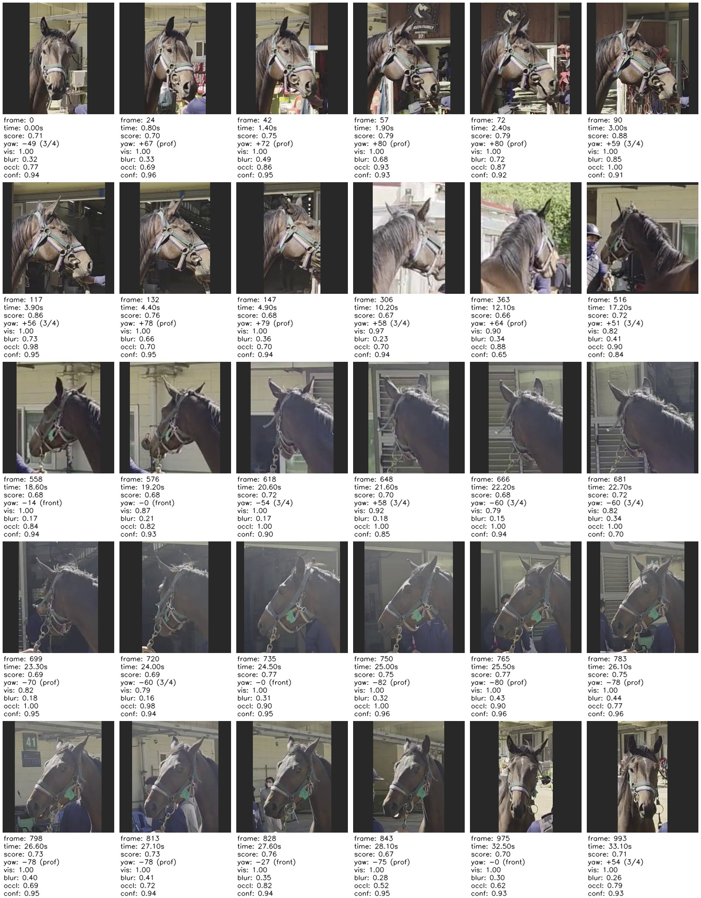

| 항목 | 값 |
|---|---|
| 말이 검출된 프레임 | 965 / 1005 |
| head stage 실행 프레임 | 335 (stride 3) |
| primary track group | 5개 track 병합 (ByteTrack이 한 마리를 12개 ID로 분할; 한 track은 "person"으로 시작해 majority-class track typing으로 해결) |
| scored candidates | 304 (min_score 0.35 통과 253, blur_ref 34.66 adaptive) |
| 선택 | 30 / 30, 0.0–33.0 s 전 구간. 프레임: [0, 24, 42, 63, 90, 117, 132, 147, 162, 318, 363, 516, 558, 576, 624, 648, 663, 681, 699, 720, 735, 750, 765, 783, 798, 813, 828, 843, 975, 990] |
| 머리 크기 (median) | 104x172 px |
| yaw bin (선택) | frontal 7 / three-quarter 9 / profile 14 |
| mean score (선택) | 0.811 |
| mean visibility (선택) | 0.948 |
| wall time | 1219 s (CPU). head stage 1065 s, Grounding DINO 약 3.2 s/frame |

25–28 s 구간에서는 frame 750, 765, 783, 798, 813, 828, 843 (25.0–28.1 s)이 선택되었다.

**검증 질문 7개**

1. **얼굴 검출이 되는가:** 예. 304개 후보 중 289개가 Grounding DINO, 15개는 heuristic fallback이며 gating 덕분에 fallback 프레임은 선택되지 않았다.
2. **tracking이 되는가:** 예. majority-class 수정 후 단일 말이 하나의 track group으로 연속 추적된다.
3. **큰 얼굴을 선호하는가:** 예. head size가 점수의 20%를 차지한다.
4. **blur 프레임이 제외되는가:** 예. Laplacian variance gate로 제외된다.
5. **사람이 가린 프레임이 제외되는가:** 예. person box 기반 occlusion score를 쓰며, 촬영자가 시야를 가린 6–8 s 부근 프레임은 0.2 미만으로 채점되었다.
6. **3/4 측면이 포함되는가:** 예. three-quarter 9 + profile 14 + frontal 7.
7. **사람이 봤을 때 진짜 머리인가:** 30장 모두 실제 머리 crop이다. 초기 실행에서 엉덩이 false positive (frame 240, head_conf 0.20)가 있어 head-confidence / head-area gate를 추가했다.

### Phase 2: 흰 무늬 segmentation

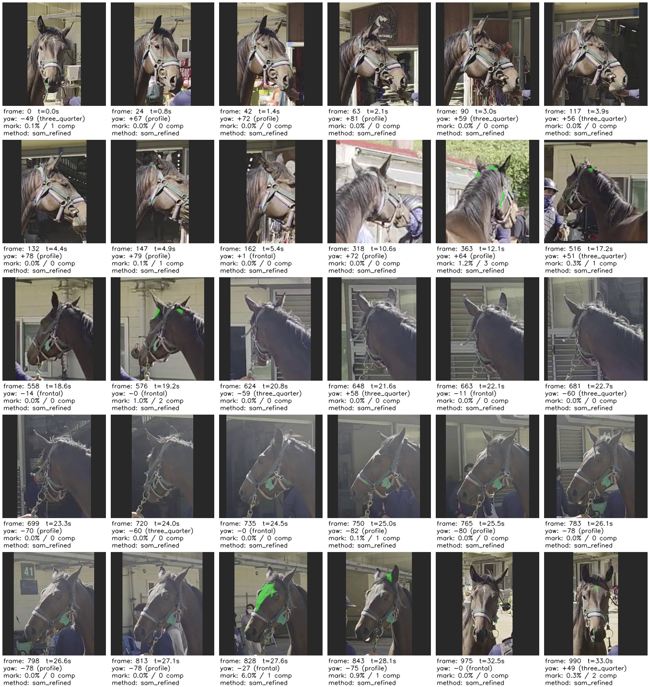

Frame 975 overlay (crop | face mask | candidate prob | final):

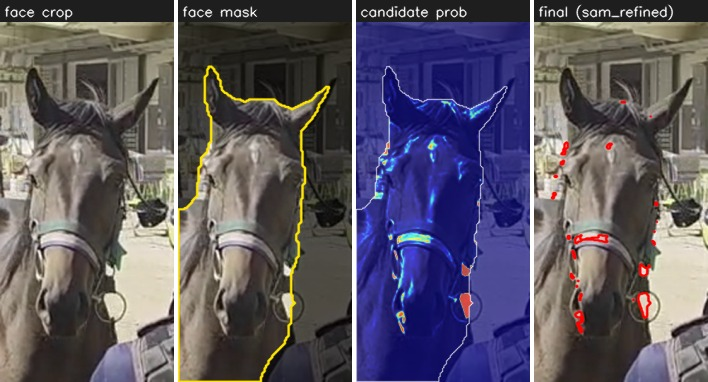

| 항목 | 값 |
|---|---|
| segmenter | `sam_refined` (30 frames) |
| marking이 accept된 프레임 | 9 / 30 (frontal 2/7, three_quarter 3/9, profile 4/14) |
| 평균 marking 면적 | 얼굴의 0.34% (전체), 1.12% (accept된 프레임) |
| 제외된 영역 | too_small 336, low_solidity 37, strap_shape 35, edge_fragment 35, outside_landmark_hull 27, sam_flood 12, above_ears 7 |
| coat class | dark 24 / medium 6 (`white_marking_applicable: true`) |
| wall time | 48.6 s (CPU) |

**솔직한 평가:** 이 말은 dark bay이고 이마에 작은 star만 있다 (2x upscale에서 약 80–180 px). star는 정면 프레임 990에서 accept된다. 세 번째 영상 작업(아래) 이후 face mask가 머리 crop 전체를 덮도록 바뀌면서 z 정규화 기준이 미세하게 달라졌고, 그 결과 frame 975의 star(84 px, z 3.4)는 후보 문턱 아래로 떨어졌다. 반대로 frame 828에서는 이마의 햇빛 광택(얼굴의 6%, z 4.5)이 새로 accept되었다: 이전에는 SAM mask가 우연히 길쭉하게 나와 `strap_shape`로 제외됐지만 이제 SAM이 범람(`sam_flood`)해 base 후보가 그대로 통과한다. 둘 다 경계선 사례이며 이 segmenter의 취약점이다. 나머지 accept 성분(예: frame 363/576)은 ear-base / poll highlight로 false positive이다. 갈기, 목, halter strap, 초록색 tag는 gate (`strap_shape`, `outside_landmark_hull`, high_chroma 등)로 제외된다. 3/4 view에서는 star가 보이지만 z-threshold 아래라 recall이 낮다. segmenter는 교체 가능한 baseline이다 (`HorseMarkingSegmenter` registry: `adaptive_color`, `sam_refined` 기본, `yolo_seg` stub).

### Phase 3: canonical marking reference

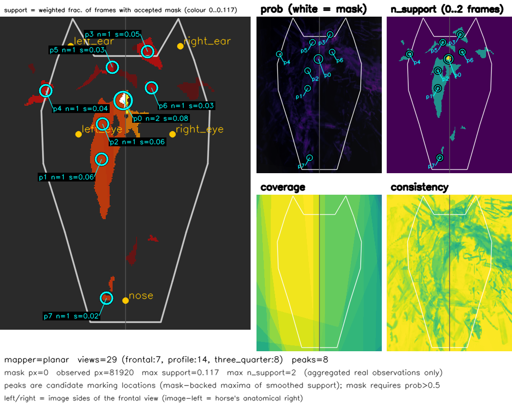

```
          HORSE MARKING           
+--------------------------------+
|                                |
|                                |
|                                |
|                                |
|                 ░*░            |
|                   ░░           |
|              ░░                |
|                ░               |
|                                |
|     *             *            |
|               *                |
|                                |
|                 ░              |
|             *    ░             |
|                                |
|                                |
|                                |
|                                |
|            *                   |
|                                |
|                                |
|                                |
|                                |
|                                |
|                                |
|                                |
|                                |
|                                |
|           ░                    |
|                                |
|                                |
|                                |
|                                |
|                                |
|                                |
|             *                  |
|                                |
|                                |
|                                |
|                                |
+--------------------------------+
value = max(prob x coverage) per cell;  ' ' <.2  ░ <.4  ▒ <.6  ▓ <.8  █ >=.8;  * = peak below ░
peaks (canonical x,y): p0(125,85) n=2 s=0.08; p1(103,145) n=1 s=0.06; p2(104,109) n=1 s=0.06; p3(150,35) n=1 s=0.05; p4(46,75) n=1 s=0.04; p5(114,51) n=1 s=0.03; p6(154,72) n=1 s=0.03; p7(108,287) n=1 s=0.02
```

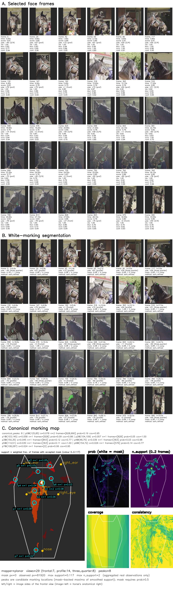

- 29 / 30 프레임 mapping (frame 648은 usable landmark/mask 없음). view: frontal 7 / 3-4 8 / profile 14.
- canonical mask px = 0: 어떤 픽셀도 prob 0.5를 넘지 못한다 (star는 1프레임에서만 accept).
- candidate peak 8개, 그중 multi-frame support 1개:
  - p0 (125,85) n=2, frames [828, 990]: 이마 star 위치. 다만 frame 828의 기여는 star가 아니라 이마 전체를 덮은 광택 patch이므로 실질적인 star 관측은 frame 990 하나다.
  - 나머지 7개는 단일 프레임 peak (828 광택 2개, 363 ear-base 2개 등)로 false positive로 추정.
- `face_embedding`: CLIP ViT-B/32, 29개 crop의 mean (보조 용도). 주 identity 증거는 canonical marking mask이다.

`reference/horse_reference.json` 구조 (일부 생략):

```json
{
  "horse_id": "unknown",
  "reference": {
    "canonical_marking_mask": "reference/canonical_mask.png",
    "face_embedding": [ "... 512-d CLIP vector ..." ],
    "face_embedding_method": "clip_ViT-B-32_mean_of_29",
    "view_count": 29,
    "views": {"three_quarter": 8, "profile": 14, "frontal": 7},
    "frames": [0, 24, 42, "..."],
    "mapper": "planar",
    "canonical_size": [256, 320],
    "files": {"prob": "...", "coverage": "...", "mask": "...", "marking": "...", "ascii": "..."},
    "canonical_peaks": [{"id": "p0", "x": 125, "y": 85, "n_support": 2, "frames": [828, 990], "...": "..."}],
    "params": {"peak_sigma": 4.0, "prob_threshold": 0.5, "...": "..."},
    "stats": {"mask_px": 0, "n_peaks": 8, "n_peaks_multi": 1, "skipped_frames": [648]},
    "notes": ["..."]
  }
}
```

### 두 번째 영상 1000018057.mp4 (회색 말, 원거리)

회색 말을 멀리서 촬영한 영상 (868 frames, 28.9 s, 720x1280 세로, CPU). 머리 크기 median 56x84 px. 원본 결과물: `docs/results/video2_*`.

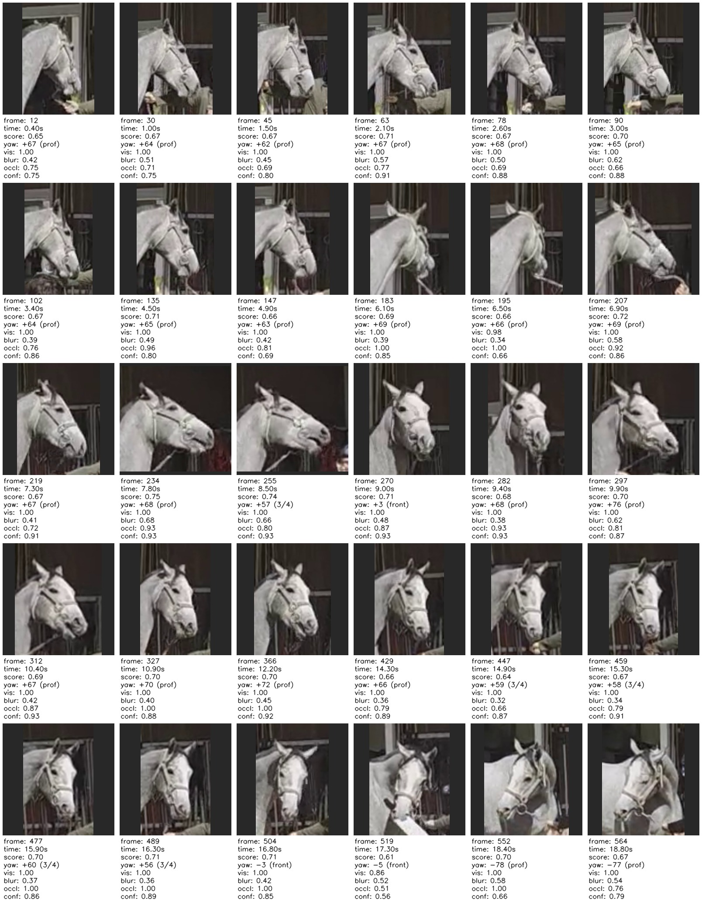

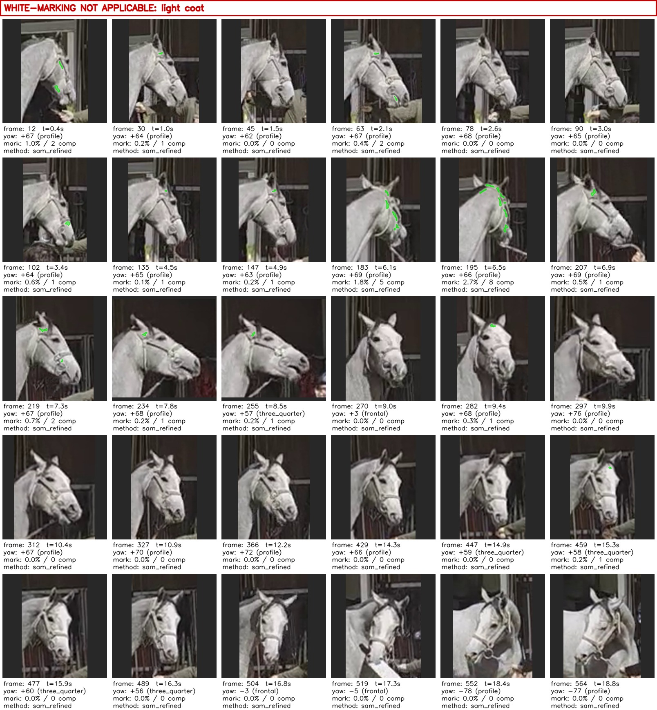

| 항목 | 값 |
|---|---|
| Phase 1 선택 | 30 / 30 (203 / 251 후보 통과, adaptive blur 기준 20.0) |
| yaw bin (선택) | profile 22 / three_quarter 5 / frontal 3 |
| 선택 시간 범위 | 0.4–18.8 s |
| wall time | 799 s (CPU), head stage 686 s |
| 품질 경고 | `median head width 56 px < 96 px` |
| Phase 2 | marking 14 / 30 프레임, 평균 얼굴의 0.31% -- 육안상 흰 털 무늬가 아니라 halter/rope highlight |
| coat class | light 21 / medium 9 (light >= 50% 이므로 `white_marking_applicable: false`) |
| Phase 3 | peak 5개, p0 (61,72) n=7 프레임 [30,63,195,207,219,234,255] -- 일관되게 밝은 털 영역이지 marking이 아님, mask_px 0 |

**솔직한 결론:** 원거리 회색 말에서도 adaptive blur 기준을 쓰면 프레임 선택은 동작한다 (30/30). 그러나 흰 무늬 segmentation은 밝은/회색 coat에는 적용할 수 없다. 흰 무늬가 coat와 분리되지 않으므로 Phase 2/3의 marking과 peak는 의미가 없고, 파이프라인이 이를 명시한다: `marking_results.json` 최상위 `"white_marking_applicable": false` + `reason`, `marking/summary.txt`의 `applicability:` 줄, `marking_sheet.jpg`의 빨간 배너. 이런 말은 다른 단서(털 소용돌이, chestnut, 흉터, muzzle 색소)가 필요하다.

### 세 번째 영상 말1.mov (dark coat, 큰 blaze, 1.1 s 근접 클립)

얼굴 가운데에 코까지 이어지는 큰 흰 줄무늬(blaze)가 있는 dark coat 말. 2704x1520 가로, HEVC, 60.8 fps, 66 frames (1.09 s). 짧은 클립이라 head stride 1로 66프레임 전부에 head stage를 돌리고 10프레임을 골랐다 (`data/input/mal1.mov`로 복사해 실행). 원본 결과물: `docs/results/video3_*`.

```bash
python scripts/run_pipeline.py --input data/input/mal1.mov --output data/output_mal1 \
    --num-frames 10 --head-detector grounding_dino --head-stride 1 --visualize --phase all --horse-id mal1
```

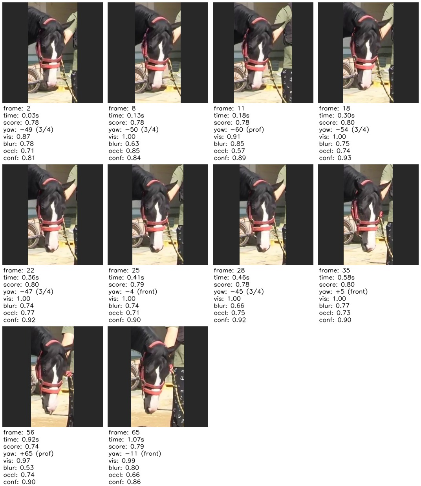

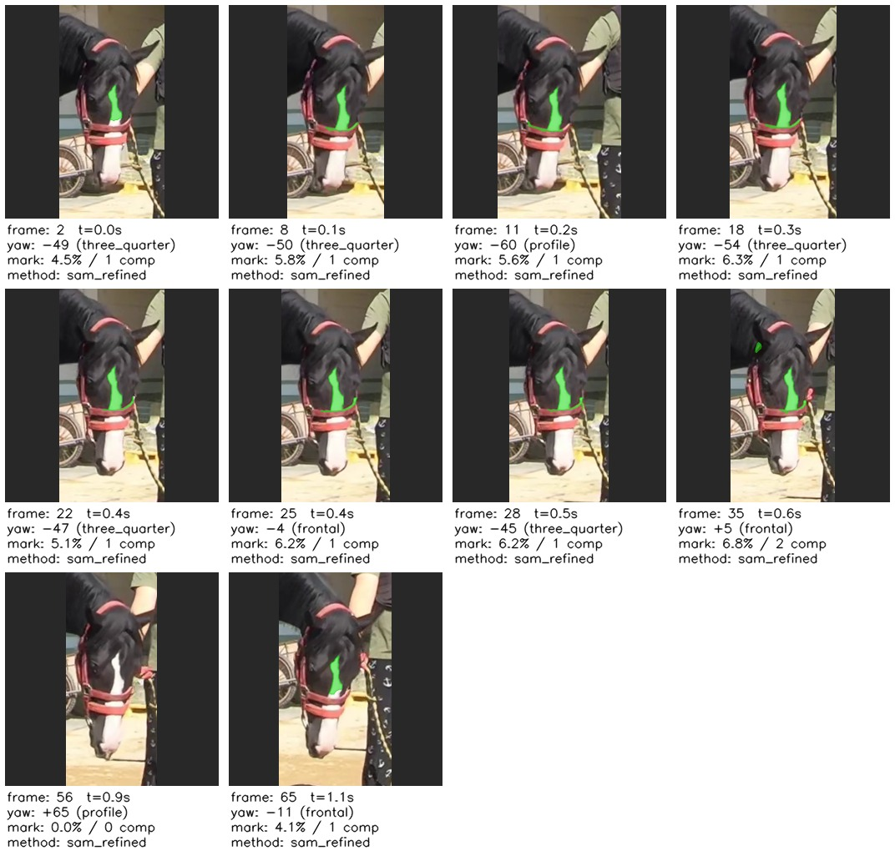

Frame 25 overlay (crop | face mask | candidate prob | final):

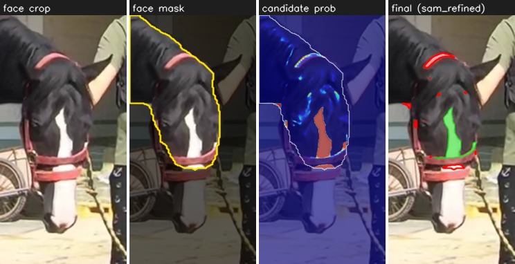

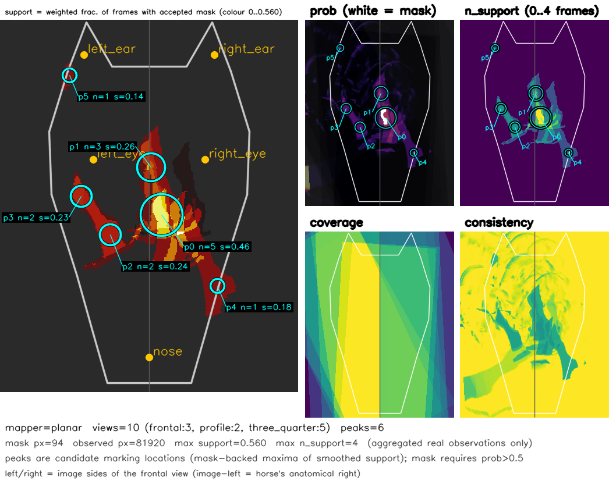

| 항목 | 값 |
|---|---|
| Phase 1 선택 | 10 / 10 (54 / 66 후보 통과, adaptive blur 기준 30.6), 0.03–1.07 s, min gap 3 frames |
| yaw bin (선택) | three_quarter 5 / frontal 3 / profile 2 (후보: 3/4 49, frontal 13, profile 4) |
| 머리 크기 (median) | 95x208 px (`< 96 px` 경고가 뜨지만 2704 px 원본이라 crop 화질은 충분) |
| wall time (Phase 1) | 243 s (head stage 218 s, 66 frames) |
| Phase 2 | marking 9 / 10 프레임 (frontal 3/3, three_quarter 5/5, profile 1/2), 평균 얼굴의 5.1% (전체), 5.6% (accept된 프레임), 32 s |
| 제외된 영역 | too_small 56, outside_landmark_hull 14, high_chroma 11 (빨간 halter), edge_fragment 9, strap_shape 4, blown_highlight 3, low_solidity 1 |
| coat class | dark 10 / 10 (`white_marking_applicable: true`) |
| Phase 3 | canonical mask px 94, peak 6개 중 multi-frame 4개: p0 (138,167) n=5 frames [2, 8, 22, 25, 35], p1 (129,126) n=3, p2 (94,184) n=2, p3 (69,151) n=2. max support 0.56, 최대 4프레임 겹침 |

```
          HORSE MARKING           
+--------------------------------+
|                                |
|                                |
|                                |
|                                |
|                                |
|       *   ░                    |
|           ░                    |
|                                |
|                                |
|                                |
|                                |
|                                |
|               ░░               |
|               ░░               |
|               ░░               |
|               ▒░               |
|        ░      ▒░░              |
|     ░ ░░      ░░░              |
|       ░░░     ░░▒              |
|       ░░░░    ░▒▒░░            |
|         ░░     ░░░░            |
|         ░░░░  ░░▒░░░           |
|          ░░░░ ░░▒░░░           |
|          ░░░░  ░░░░░░          |
|          ░░░░   ░░░░░          |
|           ░░░░░ ░░ ░░          |
|             ░░  ░░             |
|                                |
|               ░       *        |
|                                |
|                                |
|                                |
|                                |
|                                |
|                                |
|                                |
|                                |
|                                |
|                                |
|                                |
+--------------------------------+
value = max(prob x coverage) per cell;  ' ' <.2  ░ <.4  ▒ <.6  ▓ <.8  █ >=.8;  * = peak below ░
peaks (canonical x,y): p0(138,167) n=5 s=0.46; p1(129,126) n=3 s=0.26; p2(94,184) n=2 s=0.24; p3(69,151) n=2 s=0.23; p4(186,228) n=1 s=0.18; p5(59,47) n=1 s=0.14
```

**이 영상이 드러낸 문제와 수정 (모두 코드에 반영, 84 tests):**

1. **face mask가 얼굴 절반을 잘라냈다.** `horse_mask_in_crop`은 YOLO11-seg 마스크를 tracker의 말 bbox 안으로만 붙여 넣었는데, 이 영상은 말 옆에 선 사람 때문에 말 bbox 오른쪽 끝(x=1503)이 머리(x≤1565)보다 좁았다. 그래서 blaze가 있는 오른쪽 절반이 face mask 밖으로 밀려났고 첫 실행에서는 marking이 0.1% 이하였다. 이제 seg 박스를 말 bbox와 머리 crop의 합집합으로 넓힌다.
2. **blaze가 `strap_shape`로 제외됐다.** 길쭉한 영역(min-area-rect 비율 > 4)을 모두 strap으로 보던 규칙에 방향 기준을 추가했다: 영역의 주축(PCA)이 얼굴 축(ear/eye 중점 → nose)과 30° 이내면 끈이 아니라 줄무늬다. halter 끈은 얼굴을 가로지르고 blaze는 얼굴을 따라 뻗는다. 같은 기준을 `sam_refined`의 SAM-mask strap 판정에도 적용했다 (`sam_axis_deg`).
3. **blaze가 `low_solidity`, `blown_highlight`로 제외됐다.** 굽은 blaze는 convex-hull solidity가 0.36–0.50이고, 햇빛 아래 흰 털은 픽셀의 40–60%가 센서 클리핑된다. 그래서 "strong" 영역(얼굴의 1% 이상이면서 coat 대비 z ≥ 6.5)에는 solidity 하한 0.35를 쓰고 노출 게이트를 면제한다. 영상 1에서 이 게이트들이 걸러낸 영역은 z가 최대 5.9였고, 이 말의 blaze는 7.0–9.8이다.
4. **방향 예외는 strong 영역에만 적용한다.** 처음에는 방향 기준만으로 strap을 면제했는데, 영상 1의 코등을 따라 난 햇빛 광택(z 2.8–5.8)도 얼굴 축과 평행하고 길쭉해서 15 / 30 프레임이 false positive가 되었다. strong 조건을 묶자 영상 1은 기존 동작으로 돌아왔다 (위 Phase 2 표의 차이는 1번 수정의 부수 효과).

**남은 한계:** (a) YOLO11-seg 얼굴 마스크가 noseband에서 끝나 코끝까지 이어지는 blaze 아랫부분은 집계되지 않는다. (b) profile 프레임 56은 landmark hull 밖이라 제외됐다. (c) canonical map에서 blaze가 한 줄이 아니라 여러 갈래로 퍼진 것은 planar mapper가 3/4 view를 평면 template에 근사하는 정렬 오차다. (d) 1.1 s 클립이라 10프레임이 사실상 같은 pose의 연속 프레임이다.

## 6. 한계와 다음 단계

- **head-stride 비용:** CPU에서 Grounding DINO가 약 3.2 s/frame이라 stride 3에도 head stage가 1065 s. GPU 또는 더 가벼운 detector가 필요하다.
- **yaw heuristic:** profile을 과다 판정하는 경향이 있다 (profile 140 / three_quarter 139 / frontal 25).
- **segmenter:** 햇빛이 강한 dark coat에서 recall/precision이 낮다 (ear-base / 이마 광택 false positive, 작은 star 누락). SAM 결과는 face mask가 조금만 달라져도 범람 여부가 바뀌어 (`sam_flood` 시 base 후보를 그대로 통과시킴) 프레임 단위 결과가 흔들린다. AI-Hub 등으로 fine-tune한 `yolo_seg`가 다음 단계.
- **face mask:** YOLO11-seg 말 인스턴스 마스크를 쓰므로 halter noseband 아래 muzzle이 잘리는 경우가 있고, 흰 blaze의 코 쪽 끝이 집계에서 빠진다 (세 번째 영상). 머리 부위 전용 segmenter가 필요하다.
- **형태 gate (교훈):** `strap_shape`는 얼굴 축 방향을 보고 판정하고, strong 흰 영역(z ≥ 6.5, 얼굴의 1% 이상)은 solidity/노출 게이트를 완화한다. 두 임계값은 영상 1(광택 z ≤ 5.9)과 영상 3(blaze z ≥ 7.0) 두 사례로 정한 것이라 더 많은 말에서 검증이 필요하다.
- **2D planar canonical:** 3D 머리 표면이 아닌 평면 template이라 3/4, profile의 far half는 down-weight만 한다. 정렬 오차 약 10 px.
- **4DEquine:** CUDA 전용 + BSL-1.1 + VAREN 모델 등록이 필요해 이 환경에서 실행할 수 없다. adapter와 model-free 수학은 구현/테스트되어 있다. 참고: [docs/4dequine_integration.md](docs/4dequine_integration.md).
- **AI-Hub 데이터셋:** 한국 국적 로그인/승인이 필요해 이 환경에서 받을 수 없다. 가짜 데이터는 만들지 않았고 converter(`scripts/convert_aihub.py`)만 준비되어 있다. 참고: [docs/aihub_dataset.md](docs/aihub_dataset.md).
- **다중 말 영상:** 현재 track 병합은 시간 기반 규칙이다. 여러 마리가 나오는 영상에는 appearance 기반 track 병합이 필요하다.
- **blur 기준 (교훈):** 절대 blur 기준(Laplacian variance 150)은 원거리 영상에서 모든 프레임을 흐림으로 판정해 실패했다. 이제 기본값은 adaptive (실행의 median blur_var, 하한 20)이다. 또한 `median_head_px < 96 px`이면 해상도 경고를 남긴다 (두 번째 영상: 56 px).
- **밝은/회색 coat:** 흰 무늬 개념이 적용되지 않는다. `coat_L_median`(L 0..100)으로 프레임별 `coat_class` (dark < 45, medium < 65, light)를 계산하고, light가 50% 이상이면 `white_marking_applicable: false`로 표시한다.
- 모델 선택 근거는 [docs/model_selection.md](docs/model_selection.md).

## 7. 저장소 구조

```
src/horse_reid/
  config.py device.py types.py pipeline.py marking_pipeline.py
  video/reader.py                 rotation-aware VideoReader
  detection/horse_detector.py     YOLO11 + ByteTrack
  tracking/tracks.py              TrackStore, majority-class typing, primary track group
  face/                           head_detector.py (registry, heuristics), grounded_head_detector.py
  quality/                        metrics.py, scorer.py
  selection/selector.py           temporal NMS + yaw-diversity
  visualization/                  annotate.py, contact_sheet.py
  marking/                        base.py, registry.py, face_region.py, adaptive_color.py,
                                  sam_refined.py, yolo_seg.py (stub), visualize.py, aihub/convert.py
  canonical/                      base.py, planar.py, fourdequine.py, embedding.py, reference.py, io.py
scripts/                          run_pipeline.py, select_frames.py, run_marking.py,
                                  build_reference.py, convert_aihub.py
tests/                            84 tests (test_smoke, test_grounded_head, test_marking, test_canonical)
docs/                             model_selection.md, aihub_dataset.md, 4dequine_integration.md, results/
```

## 8. 라이선스 / 출처

| 구성요소 | 라이선스 | 비고 |
|---|---|---|
| YOLO11 (ultralytics) | AGPL-3.0 | |
| Grounding DINO | Apache-2.0 | HuggingFace transformers 경유 |
| MobileSAM | Apache-2.0 | |
| CLIP | MIT | |
| 4DEquine | BSL-1.1 | 저장소에 포함하지 않음 |
| VAREN | 별도 등록 필요 | 포함하지 않음 |
